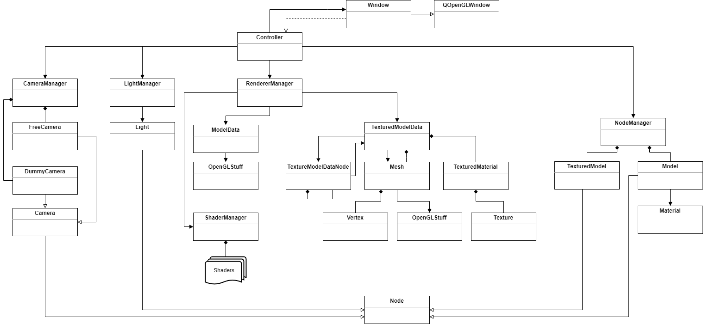

# Canavar Graphics Engine

A basic graphics engine written with `C++` using `OpenGL API`.
I use `Qt 5` for window and event management. Also I use `ImGui` for UI.
All 3D math operation is done by `Qt 5`'s math module.
The engine has following features:
- Supports loading several 3D model formats thanks to `assimp` library
- Parent - child node hiearchy
- Transformation of individual meshes of models
- Particle generator
- Terrain, sky, sun, volumetric clouds, water, haze
- Dummy and free cameras
- Directional, point and spot lights
- Easy shader loading and linking
- Framebuffer generation with several attachments and different formats 

I will add following features:
- Editor
- WGS84 support
- Terrain generation using DTED
- Albedo generation using satellite images
- Post processing effects
## Screenshot

## Build
// TODO

## Usage
Creating a model can be done with one liner:
```
Node *aircraft = NodeManager::instance()->create(Node::NodeType::Model, "f16c");
```
`NodeManager` class automatically register this model to render list. You do not have to do anything else.
Ownership belongs to `NodeManager`. You can remove any node with one liner again.
```
NodeManager::instance()->removeNode(aircraft);
```
It is `NodeManager`'s responsibility to the clean up the resources.

Attaching a camera to a node is also easy:
```
Camera *camera = NodeManager::instance()->create(Node::NodeType::DummyCamera);
aircraft->addChild(camera);
```
You can set local position of `camera`:

```
camera->setPosition(QVector3D(0, 0, 10));
```
Now you can set `camera` as the active camera:

```
CameraManager::instance()->setActiveCamera(camera);
```
## UML Diagram

## Acknowledgements
// TODO
